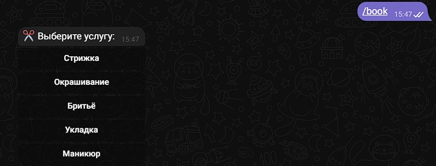
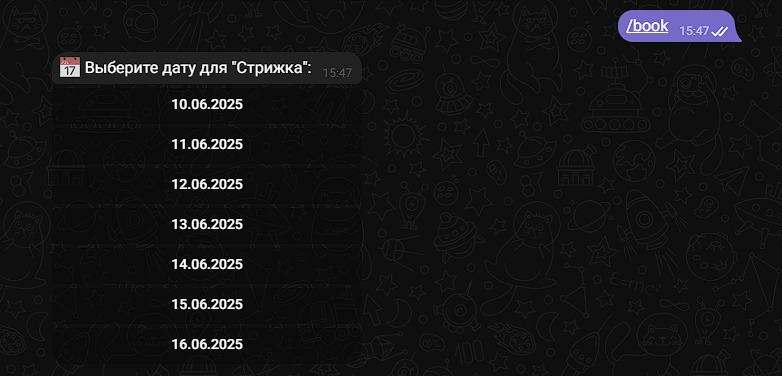
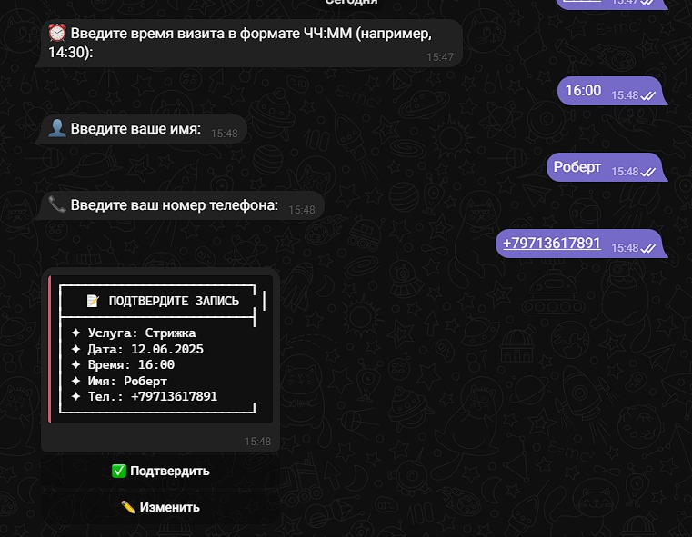
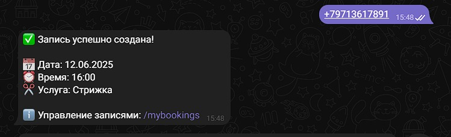
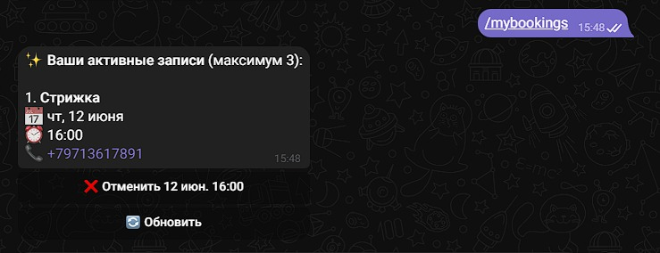
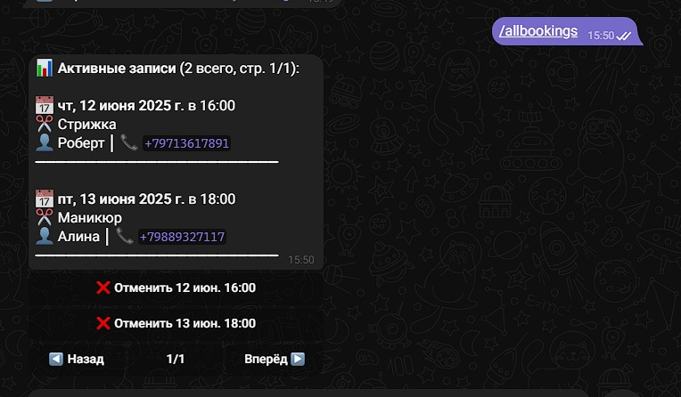

# 💈 Barbershop Bot - Telegram бот для парикмахерской

<span>
  
  


  
</span>

**Помощник для вашей парикмахерской** 🤖✂️  
Бот помогает клиентам записываться на услуги, выбирать мастера и получать уведомления о записи.

---

## 📸 Работа нашего бота

## 🔎 Приветственное сообщение и помощь по командам (/start, /help)


## 📝 Запись к парикмахеру






## 🖇️ Просмотр записей как клиент, так и парикмахер:




---

## 📗 Библиотеки которые используются:

- telegraf: ^4.16.3;
- telegraf-session-local: "^2.1.1;
- nedb: ^1.8.0;

---

## 🌟 Возможности:

### **Для клиентов:**

- 🗓️ Удобная запись онлайн (выбор даты, времени)
- 📱 Личный кабинет с просмотром своих записей и их отменой

### **Для администрации**

- 📊 Просмотр всех записей
- 🛠️ Управление всеми записями
- 📢 Парикмахер получает уведомления о новой записи.

---

## 🚀 Быстрый старт

### **1. Установка зависимостей**

```bash
↳ npm install
```

### **2. Запуск бота**

```bash
↳ node .
```

_Репозиторий всё ещё в разработке.._
